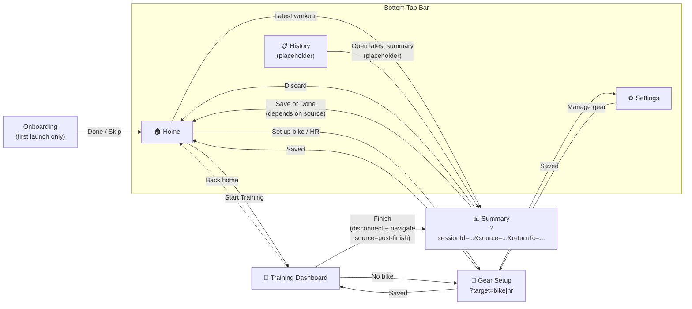
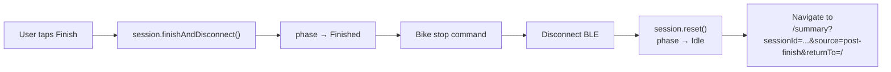
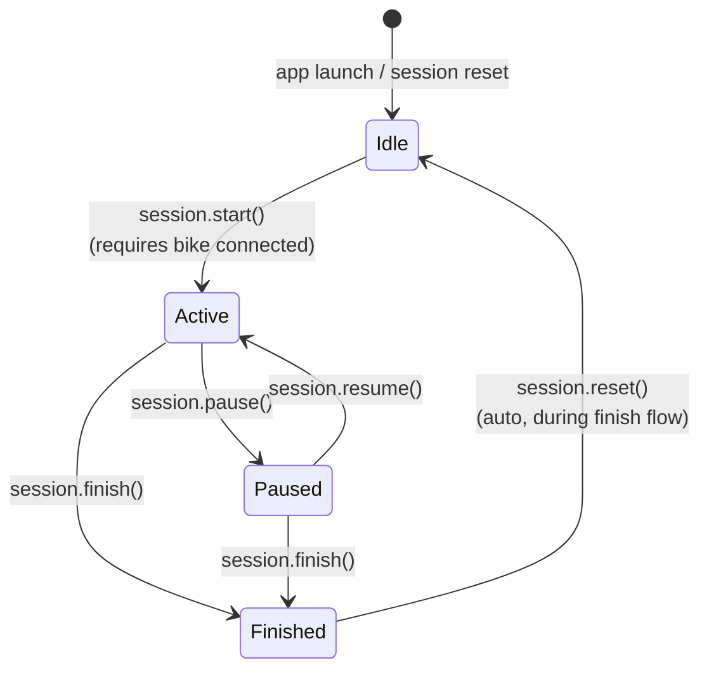

# Screen Architecture

Navigation structure, screen inventory, and flow diagrams for the Omni Bike app.
Update this file whenever screens are added, removed, or rerouted.

---

## Screen Inventory

| Route | Screen | Status |
|---|---|---|
| — (pre-nav gate) | OnboardingScreen | Live |
| `/` | HomeScreen | Live |
| `/history` | HistoryScreen | Placeholder (Phase 4) |
| `/settings` | SettingsScreen | Live |
| `/training` | TrainingDashboardScreen | Live |
| `/summary?sessionId=...&source=...&returnTo=...` | TrainingSummaryScreen | Live |
| `/gear-setup?target=bike\|hr` | GearSetupScreen | Live |

---

## Navigation Structure

---

## Training Finish Flow

Session is finalized in DB (with `uploadState='ready'`) during the `Active → Finished` transition. The `Finished → Idle` reset clears in-memory state but preserves the DB record.

---

## Training Phase State Machine

**Phase gating:**
- `TrainingDashboardScreen` — centered elapsed-time hero, four primary live metrics, compact bike/HR connection status, and buttons per phase: Start Ride / Pause+Finish / Resume+Finish (no Finished state shown)
- `TrainingSummaryScreen` — DB-driven, no phase dependency; shows `Discard + Save` after finishing, or `Discard + Done` when opened from saved-workout entry points
- `HomeScreen` — Quick Start button, disabled if bike not connected; latest workout shortcut opens the newest finished session

---

## Gear Setup Sub-Flow

```mermaid
flowchart TD
    A["Open /gear-setup?target=..."] --> B["Request BLE Permission"]
    B -->|denied| C["Alert: Open Settings"]
    B -->|granted| D["Start Scan"]
    D --> E["User selects device"]
    E --> F{"Validation"}
    F -->|connecting| G["Connecting…"]
    G -->|connected| H["Awaiting live signal…"]
    H -->|signal OK| I["Signal received ✓"]
    H -->|timeout| J["Error: no_live_signal"]
    G -->|failed| K["Error: connection_failed"]
    F -->|missing service| L["Error: incompatibility<br/>(FTMS / HR service)"]
    I --> M["Save device → back()"]
    J --> N["Reset — try again"]
    K --> N
    L --> N
```

---

## Conditional Navigation Gates

| Condition | Effect |
|---|---|
| First launch, onboarding not completed | Root layout redirects to OnboardingScreen before tab navigation |
| Bike not connected | "Start Training" disabled on Home; callout shown in Training |
| No bike saved | "Set Up Bike" shown on Home bike tile |
| Neither device connected | "Disconnect Active Gear" disabled in Settings |

---

## Summary Screen Actions

| Action | Behavior |
|---|---|
| **Discard** | Confirmation alert → delete session + samples from DB → navigate home |
| **Save** | Post-finish only. Keep the finished session in DB and return home. The header back button is hidden here to keep the finish flow one-way |
| **Done** | Saved-workout viewer mode only. Return to the explicit tab route (`/` or `/history`), or home if no return route was provided |

The Summary screen loads session data from DB by `sessionId` route param. The `source` param distinguishes the just-finished confirmation flow from saved-workout viewing opened from Home or History, and `returnTo` gives the saved-workout viewer a deterministic destination for both `Done` and the top header back button. Third-party upload entry points are deferred to future Settings and workout-history flows.

---

## Current Training Screen Structure

Current content placement in `TrainingDashboardScreen` is intentionally simplified:

- top hero block: elapsed time plus a short phase summary (`Ready to ride`, `Ride in progress`, `Ride paused`)
- primary metrics grid: Speed, Distance, Power, Heart Rate
- compact connection row: Bike, Heart Rate
- controls block: Start Ride / Pause / Resume / Finish
- disconnected-bike callout appears inside the controls block only when needed

This keeps the active workout flow focused on the main ride signal and the minimal controls needed to continue or finish the session.
