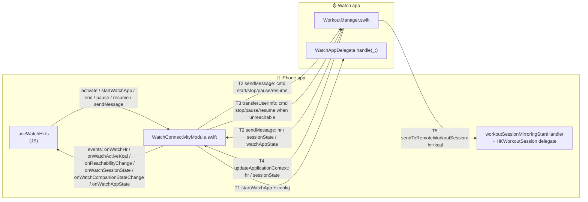
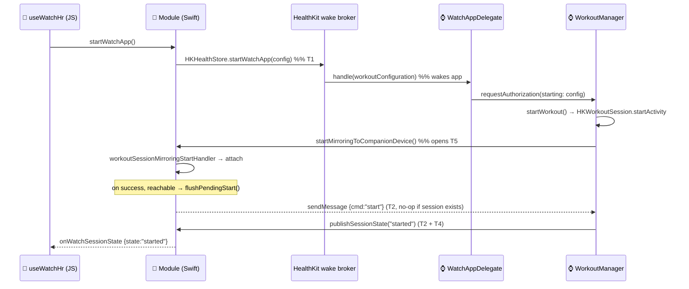
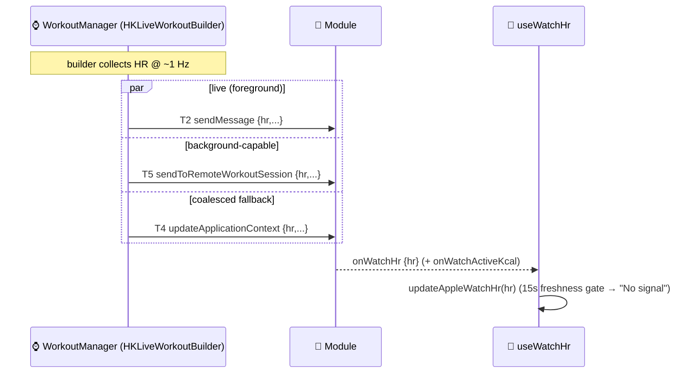
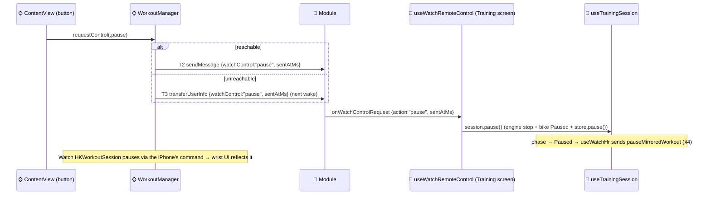
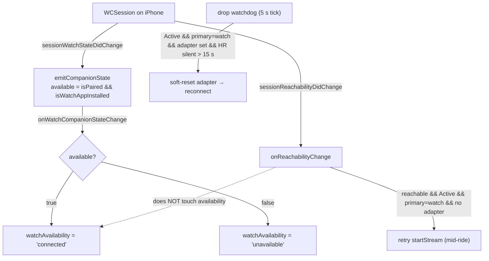

# Apple Watch ⇄ iPhone Communication Flows

All communication paths between the **OmniBike Watch app** and the **iPhone (mobile) app**,
derived directly from the native bridge:

- iPhone module: `modules/watch-connectivity/ios/WatchConnectivityModule.swift`
- iPhone JS bridge: `modules/watch-connectivity/src/index.ts` → consumed in `src/features/gear/hooks/useWatchHr.ts`
- Watch app: `ios/OmniBikeWatch Watch App/WorkoutManager.swift`, `WatchAppDelegate.swift`, `OmniBikeWatchApp.swift`

> **Roles.** The **iPhone decides** *when* a workout starts/stops/pauses (it sends commands).
> The **Watch owns** the `HKWorkoutSession` — only it can call `startActivity` / `end` /
> `pause` / `resume`. The Watch is a **pure HR source**: it never persists an `HKWorkout`
> (`discardWorkout` on teardown), it only streams HR + active-kcal to the iPhone.

---

## 1. Transports at a glance

The bridge uses **five distinct transports**, each with different reachability and
background guarantees. Picking the right one per message is the whole game.

| # | Transport | Direction | Needs `isReachable`? | Works backgrounded? | Delivery |
|---|---|---|---|---|---|
| T1 | `HKHealthStore.startWatchApp(with:)` | 📱→⌚ | no (HK wake broker) | **wakes/launches** the watch app | one-shot launch + config |
| T2 | WCSession `sendMessage` | ⌚⇄📱 | **yes** | no (both ~foreground) | live, fire-and-forget |
| T3 | WCSession `transferUserInfo` | 📱→⌚ | no | **yes** (delivered on next wake) | FIFO queue, guaranteed |
| T4 | WCSession `updateApplicationContext` | ⌚→📱 | no | **yes** | latest-value-only (coalesced) |
| T5 | `HKWorkoutSession` mirroring (`sendToRemoteWorkoutSession` / `didReceiveDataFromRemoteWorkoutSession`) | ⌚→📱 | no | **yes** (survives a dimmed/backgrounded ride) | streamed during active session |

Plus **framework-driven callbacks** (no app payload): activation, reachability change,
and companion-state (paired/installed) change.



---

## 2. iPhone → Watch (commands)

The iPhone never measures HR; it only **drives the session**. Every command keys off `cmd`.

| What | JS call | Transport | Payload | Watch handler |
|---|---|---|---|---|
| Wake watch app + start ride | `startWatchApp()` | **T1** | `HKWorkoutConfiguration` (cycling/indoor) | `WatchAppDelegate.handle(_:)` → `requestAuthorization(starting:)` → `startWorkout` |
| Start (backup trigger) | (auto, after T1 succeeds, when reachable — `flushPendingStart`) | **T2** | `{cmd:"start"}` | `handleCommand` → `startWorkout` |
| Stop | `endMirroredWorkout()` | **T2** if reachable, else **T3** | `{cmd:"stop"}` | `handleCommand` → `stopWorkout` → `session.end()` |
| Pause | `pauseMirroredWorkout()` | **T2** if reachable, else **T3** | `{cmd:"pause"}` | `handleCommand` → `pauseWorkout` → `session.pause()` |
| Resume | `resumeMirroredWorkout()` | **T2** if reachable, else **T3** | `{cmd:"resume"}` | `handleCommand` → `resumeWorkout` → `session.resume()` |

Notes:
- **Two start paths converge.** T1 (HealthKit wake + config) and the T2 `cmd:"start"` message
  both end at `startWorkout`, which **no-ops if a session already exists** (`session != nil`) —
  so the redundancy is safe. T1 can wake a suspended watch app; T2 alone cannot.
- **`start` is never queued.** It's gated behind `pendingStart` and only flushed via T2 once the
  Watch is reachable. `stop`/`pause`/`resume` fall back to **T3 (`transferUserInfo`)** when
  unreachable, so an end-of-ride stop still reaches an orphaned session on the next wake.

### Start-ride sequence



---

## 3. Watch → iPhone (HR, kcal, session state, lifecycle)

### 3a. Heart rate + active kcal (~1 Hz during a workout)

`sendHrToPhone` fires the **same payload over three transports at once** for maximum
resilience — whichever arrives first wins; the iPhone treats each as "stream alive."

| Transport | Condition | iPhone entry point → event |
|---|---|---|
| **T2** `sendMessage` | only if `isReachable` | `didReceiveMessage` → `emitHr`/`emitActiveKcal` |
| **T5** `sendToRemoteWorkoutSession` | watchOS 10+, active session exists | `didReceiveDataFromRemoteWorkoutSession` → `emitHr`/`emitActiveKcal` |
| **T4** `updateApplicationContext` | always (when activated) | `didReceiveApplicationContext` → `emitHr`/`emitActiveKcal` |

Payload: `{ hr, sentAtMs, activeKcal? }` (kcal omitted until HealthKit produces its first
`activeEnergyBurned` sample). All land on JS as `onWatchHr` → `updateAppleWatchHr` and
`onWatchActiveKcal` → `updateAppleWatchActiveKcal`.

> **De-dup (one emit per sample).** Because all three transports carry the *same* `sentAtMs`,
> the iPhone module keeps a monotonic high-water mark and emits a given sample **once** —
> any copy whose `sentAtMs` is not newer than the last emitted is dropped (`shouldEmitSample`).
> Without this each ~1 Hz sample reached JS 2–3× (and cumulative `activeKcal` could be
> re-emitted out of order). A sample with no `sentAtMs` can't be de-duped, so it passes through.

> **Why three?** T5 is the only channel that keeps delivering while the watch screen is
> **dimmed** (app still frontmost — the reason `HKLiveWorkoutBuilder` is used as the sample
> pipe). T2 is the snappy foreground path. T4 is the always-on coalesced fallback.
>
> **Caveat — true background ≠ dimmed.** When the watch app is left for the watch face (true
> background), HR *collection* is suspend-and-batched by watchOS, so even T5 goes sparse
> (gaps of 30 s–5 min) and the phone shows "No signal". Reliable ~5 s HR needs the watch app
> frontmost/Always-On. Feasibility, evidence, and ruled-out fixes:
> [`background-hr-feasibility.md`](background-hr-feasibility.md).



### 3b. Session state — **two independent routes**

`started` / `ended` / `failed` reaches the iPhone via **both**:

1. **WC message route:** Watch `publishSessionState` → T2 (if reachable) **+** T4 →
   `emitSessionState` → `onWatchSessionState`. Queued in `pendingSessionStatePayload` and
   flushed on WC activation if not yet activated.
2. **Mirrored-session delegate route:** the iPhone's attached `HKWorkoutSession` delegate fires
   `workoutSession didChangeTo .running/.ended` → `emitSessionState("started"/"ended")`, and
   `didFailWithError` → `"failed"`. This needs no watch app message at all.

On JS, `onWatchSessionState` is currently **logging-only** (availability is companion-driven —
see §5).

### 3c. Watch app lifecycle (observability)

`reportAppState` (from SwiftUI `scenePhase` in `OmniBikeWatchApp`) → T2 best-effort (reachable
only) → `emitWatchAppState` → `onWatchAppState`. Payload `{watchAppState: "active"|"inactive"|
"background", sentAtMs}`. JS logs it only. Unlike `isReachable`, this is an explicit event when
the watch app foregrounds/backgrounds, useful for debugging — but it requires the app to be running.

---

## 4. Pause / resume and end (incl. unreachable fallback)

```mermaid
sequenceDiagram
  participant JS as 📱 useWatchHr
  participant Mod as 📱 Module
  participant WM as ⌚ WorkoutManager

  Note over JS: phase Active→Paused (primary=watch)
  JS->>Mod: pauseMirroredWorkout()
  alt Watch reachable
    Mod->>WM: T2 sendMessage {cmd:"pause"}
  else unreachable
    Mod->>WM: T3 transferUserInfo {cmd:"pause"}  (delivered next wake)
  end
  WM->>WM: session.pause() → HKWorkoutSession .paused
  Note over WM: timer + HR collection stop; no echoed sessionState

  Note over JS: phase Paused→Active
  JS->>Mod: resumeMirroredWorkout()
  Mod->>WM: T2/T3 {cmd:"resume"} → session.resume()

  Note over JS: phase → Finished/Idle
  JS->>Mod: endMirroredWorkout()
  alt reachable
    Mod->>WM: T2 {cmd:"stop"}
  else unreachable
    Mod->>WM: T3 transferUserInfo {cmd:"stop"}  (ends orphan on next wake)
  end
  WM->>WM: session.end() → .ended → publishSessionState("ended") + discardWorkout
  WM->>Mod: onWatchSessionState {state:"ended"} (+ mirrored .ended delegate)
```

> **Rapid pause/resume is hardened on both sides.** `HKWorkoutSession.state` lags HealthKit's
> real transition, so two `pause` commands a few ms apart can both pass the watch's
> `state == .running` guard and call `session.pause()` twice — and a redundant `pause()` makes
> HealthKit emit `didFailWithError ("Unable to perform 'pause' from current state 'Paused'")`,
> whose handler tears the whole session down (ride dies, watch stuck "Paused"). Two layers fix it:
> the **watch** keeps a `pauseResumeInFlight` interlock (at most one in-flight transition; cleared
> on the next `didChangeTo .running/.paused`), and the **phone** debounces pause/resume
> (`WATCH_PAUSE_RESUME_DEBOUNCE_MS`) so a rapid Active⇄Paused toggle collapses to the single
> settled intent instead of flooding the watch.

**Orphan recovery:** if a ride ended while the Watch was unreachable and the stop never
arrived, `WorkoutManager.recoverOrphanedSession()` (on watch app launch) finds the still-running
`HKWorkoutSession` via `recoverActiveWorkoutSession` and ends + discards it, so the UI doesn't
falsely show "in progress."

### 4a. Watch-initiated controls — "watch as remote" (⌚→📱)

The Watch app's on-wrist **Pause / Resume / End** buttons do **not** touch the Watch's own
`HKWorkoutSession` directly. The iPhone owns the ride (MetronomeEngine, BLE FTMS bike control,
persistence, navigation), so the wrist sends a **control request** and the iPhone runs the same
action a phone tap would — which then drives the Watch session back through the existing §4 command
path. This keeps the iPhone the single source of truth and is purely additive over the existing flow.

| What | Watch send | Transport | Payload | iPhone handling |
|---|---|---|---|---|
| Pause/Resume/End from the wrist | `WorkoutManager.requestControl(_:)` | **T2** if reachable, else **T3** | `{watchControl: "pause"\|"resume"\|"end", sentAtMs}` | `didReceiveMessage`/`didReceiveUserInfo` → `emit onWatchControlRequest`; JS ignores stale requests older than 60 s |



Phase guards live in the iPhone handlers (`pause` only from Active, `resume` only from Paused,
`finish` only from Active/Paused), so a stray/duplicate request is a safe no-op — the redundant
iPhone→Watch command that follows hits the Watch's own `session.state` guards. **End** routes through
the screen's `handleFinish`, so it finishes + navigates to the Summary exactly like the phone button.

> **Accepted limitation.** If the iPhone app is fully backgrounded with JS suspended, a wrist control
> is processed when the app next resumes (`transferUserInfo` is FIFO-queued). During a ride the phone
> is normally foreground + kept awake (`useKeepAwakeDuringTraining`), so controls are live. To avoid
> applying an old queued tap to a later ride, JS drops controls whose `sentAtMs` is more than 60 s old.

---

## 5. Availability, reachability & activation (framework-driven)

These carry **no app payload** — they're WCSession lifecycle callbacks surfaced as JS events.

| Native callback | JS event | Drives |
|---|---|---|
| `activate()` / `activationDidCompleteWith` | (resolves promise) + emits the two below | session setup |
| `sessionReachabilityDidChange` | `onReachabilityChange` `{reachable, paired, installed}` | **mid-ride HR-stream retry** + `flushPendingStart`. **Does NOT set availability.** |
| `sessionWatchStateDidChange` (paired/installed changed) | `onWatchCompanionStateChange` `{available, paired, installed, ...}` | **`watchAvailability`**: `setWatchAvailability(available ? 'connected' : 'unavailable')` |

`available = isPaired && isWatchAppInstalled`. **Install/uninstall is OS-detected** — the watch
app fires no "installed" hook (it isn't running at install time); the daemon notifies the
iPhone's `WCSession` and `sessionWatchStateDidChange` fires. This is why the watch's availability
is **stable** and doesn't flap when the idle watch app suspends.

**Internal state vs displayed label:** `watchAvailability` is the internal value
(`'connected' | 'unavailable'`). It renders through the canonical `DeviceStatus` vocabulary
(`watchHrStatus` → `deviceStatusLabel`): `'connected'` → **"Ready"**, `'unavailable'` →
**"Unavailable"**, and **"Off"** when the watch isn't the selected primary source. So the tile
the user sees reads *Ready / Unavailable / Off*, not "Connected".



> **"Ready" ≠ HR flowing.** Availability answers *"is the watch here (paired + installed)?"*.
> The live-HR truth is separate: a 15 s freshness gate (`HR_NO_SIGNAL_TIMEOUT_MS`, in
> `resolveHrReading`) shows **"No signal"** on the HR number when samples stop, even while the
> availability stays **"Ready"**. (In-workout the tile also surfaces **"Connecting…"** before the
> first sample and **"Paused"** while paused — see the device-status state machine in
> `hr-source-feature-status.md`.)
>
> **Mid-ride drop recovery (silent drop).** The reachability retry above only fires when
> `adapterRef` is null. A Watch can stop delivering HR with **no** JS-visible disconnect
> (out of range and back, an `HKLiveWorkoutBuilder` stall, a dead mirrored session) — the
> adapter stays non-null, so that retry never re-fires and the tile is stuck on "No signal"
> for the rest of the ride. `useWatchHr` runs a **5 s drop watchdog** while a watch-primary
> ride is Active: once HR has been silent past the freshness window on an established stream,
> it treats the Watch as dropped, soft-resets the stale adapter (no `disconnect`, so a
> still-alive Watch session is not ended) and reconnects — backing off a full freshness
> window between attempts. The watchdog is cleared while Paused (pause silence is expected).

---

## 6. Complete event/message catalog

### JS-facing events (`modules/watch-connectivity/src/index.ts`) and their consumer

| Event | Payload | Source transport | `useWatchHr` action |
|---|---|---|---|
| `onWatchHr` | `{hr}` | T2 / T4 / T5 (de-duped on `sentAtMs`, §3a) | `updateAppleWatchHr` |
| `onWatchActiveKcal` | `{activeKcal}` | T2 / T4 / T5 (de-duped on `sentAtMs`, §3a) | `updateAppleWatchActiveKcal` |
| `onReachabilityChange` | `{reachable, paired, installed, activationState}` | `sessionReachabilityDidChange` | mid-ride stream retry (not availability) |
| `onWatchSessionState` | `{state, sentAtMs}` | T2/T4 message **or** mirrored-session delegate | logging only |
| `onWatchCompanionStateChange` | `{available, paired, installed, ...}` | `sessionWatchStateDidChange` / activate | `setWatchAvailability` |
| `onWatchAppState` | `{state}` | T2 (`reportAppState`) | logging only |
| `onWatchControlRequest` | `{action: "pause"\|"resume"\|"end", sentAtMs?}` | T2/T3 (`watchControl`, §4a) | `useWatchRemoteControl` → stale filter → `session.pause`/`resume`/`handleFinish` |

### Native JS→native functions (`WatchConnectivity` module)

| Function | Effect |
|---|---|
| `activate()` | Activate WCSession; emits reachability + companion state |
| `startWatchApp()` | T1 wake + config; arms `pendingStart` (T2 `cmd:start` on reachable) |
| `endMirroredWorkout()` | T2/T3 `cmd:stop`; clears `pendingStart` |
| `pauseMirroredWorkout()` | T2/T3 `cmd:pause` |
| `resumeMirroredWorkout()` | T2/T3 `cmd:resume` |

---

## 7. Log prefixes (for debugging on-device)

- `[WC-iPhone] …` — iPhone module (`Documents/wc.log` on the phone) + Metro NSLog.
- `[WC-Watch] …` — watch app (`Documents/wc.log` on the watch).
- `[WC-JS] …` — JS traces (`logWc`) in Metro.

Key lines: `emitCompanionState available= paired= installed=` (availability ground truth),
`sessionReachabilityDidChange reachable=`, `didReceiveDataFromRemoteWorkoutSession hr=` (T5),
`sendHrToPhone` (watch send), `handleCommand cmd=` (command receipt).

See `docs/apple-watch/wake-on-start.md` for the start-from-iPhone wake caveats, and
`.claude/skills/manual-test-handoff` for the log-pull commands.
